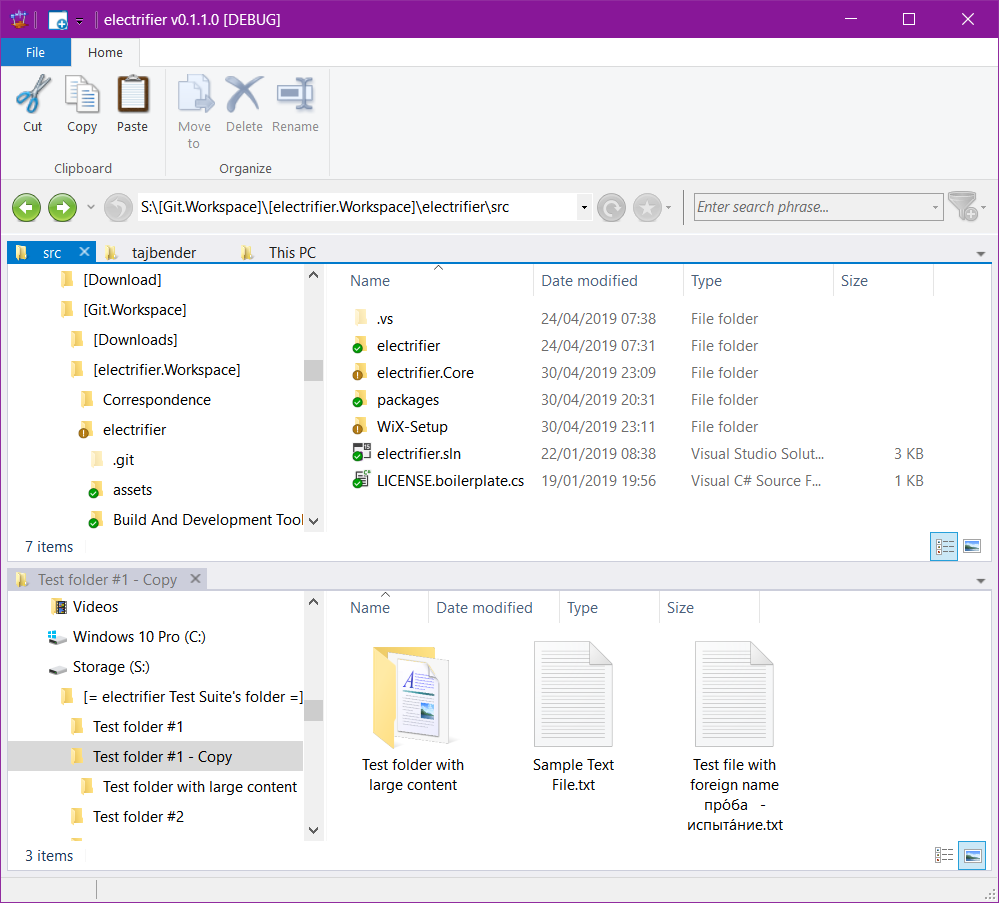

# electrifier

Desktop enhancement suite

electrifier is an open-source project which extends Windows :registered: Explorer with

- [x] Full-featured multi-tab experience
- [ ] Built-in file viewers and plain editors
- [ ] Session management and history functionality
- [ ] PowerShell integration, automation and extensibility

However, since electrifier is still in early development stages, most mentioned features are currently work in progress or just plans for the future.

If you want to get involved in its development feel free to contribute!

# History

Released | Version | Details
:------: | :-----: | :------
04/05/19 | 0.1.1 | An internal alpha test is currently in progress

Originally, the project was started back in 2004, using .NET-framework 1.0 and Windows XP. However, due to a system crash, I lost all my data, including the source-code, which was stored on a software RAID-5.

Meanwhile I managed to restore those lost artefacts, converted them to Visual Studio 2019 and .NET 4.6 and relaunched the development cycle.

# Development

electrifier is developed using Visual Studio Community 2019 and uses .NET-framework 4.6.

## Contributions

electrifier makes use of the following third party components:

Name | Author(s) | License
---- | --------- | -------
[Vanara](https://github.com/dahall/Vanara) | [David Hall](https://github.com/dahall) | MIT License
[DockPanel Suite](https://github.com/dockpanelsuite/dockpanelsuite) | [Lex Li](https://github.com/lextm), [Ryan Rastedt](https://github.com/roken) & others | MIT License
[Sunburst.WindowsForms.Ribbon](https://github.com/SunburstApps/Sunburst.WindowsForms.Ribbon) | [William Kent](https://github.com/wjk) | Microsoft Public License (Ms-PL)
[Knob Buttons Toolbar icons](https://www.deviantart.com/itweek/art/Knob-Buttons-Toolbar-icons-73463960) | [iTweek](https://www.deviantart.com/itweek) aka Miles Ponson| [Custom]

## Contributing

Currently, the project is in an early alpha-stage. However, if you feel interested in helping me out, you are welcome to contact me.

# Pre-Requisites

To run electrifier, you supposedly need nothing except a running Windows Operating System, Vista SP1 or above. The .NET-framework should be installed due normal Windows-Update cycle.

## Building electrifier

* Install [Visual Studio Community 2019](https://visualstudio.microsoft.com/de/vs/community/) using at least the following Workloads:
  * `.NET desktop development`
  * `Desktop development with C++` (Required for the Ribbon Ressource Compiler)
* Download the sources to extract them into an empty folder
* From there, use `electrifier/src/electrifier.sln` to open the project solution in Visual Studio
* In Solution Explorer, right-click `Solution 'electrifier' (3 projects)` to `Restore NuGet Packages`
* In Solution Explorer, right-click project `electrifier` to `Set as StartUp Project`
* Hit `F6`-key to `Build Solution`
* Violá! In case you reached so far without ciritical errors, you've just successfully built electrifier :+1:
* Hit `F5`-key to `Start Debugging`. Since electrifier will start with a blank UI at present, click `New Panel` from the ribbon to open a fresh electrifier Shell Browser window

:warning: To successfully build `Setup`, further steps have to be taken!

# License

    Copyright 2017-19 Thorsten Jung, www.electrifier.org
 
    Licensed under the Apache License, Version 2.0 (the "License");
    you may not use this file except in compliance with the License.
    You may obtain a copy of the License at
 
        http://www.apache.org/licenses/LICENSE-2.0
 
    Unless required by applicable law or agreed to in writing, software
    distributed under the License is distributed on an "AS IS" BASIS,
    WITHOUT WARRANTIES OR CONDITIONS OF ANY KIND, either express or implied.
    See the License for the specific language governing permissions and
    limitations under the License.

:pencil2: Last updated :calendar: May the 4th, 2019
